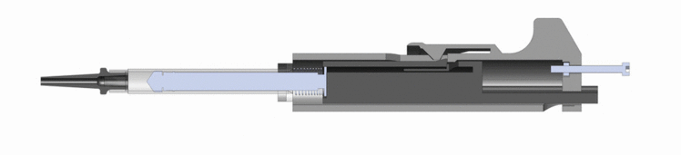

3D Printable Micropipette
=========================

This printable micropipette actuates a disposable syringe to an adjustable set-point using an assembly of 3D-printable parts and basic hardware.

##Parts

| Parts        | price/build | Source         | Part number |
|--------------|-------------|----------------|-------------|
| Filiment     | $1.63       | Makerbot       | NA          |
| 1 mL Syringe | $0.15       | BD Biosciences | 309628      |
| 3 mL Syringe | $0.73       | BD Biosciences | 309657      |
| Bolt         | $0.12       | McMaster-Carr  | 91287A026   |
| Nut          | $0.01       | McMaster-Carr  | 90591A121   |
| Spring       | $4.14       | McMaster-Carr  | 94125K542   |

##Validation

|                    | 20 uL         | 50 uL        | 200 uL       |
|--------------------|---------------|--------------|--------------|
| Printed Pipette    | 19.5 ± 0.612  | 53.53 ± 1.76 | 196.4 ± 2.23 |
| Commercial Pipette | 19.87 ± 0.164 | 49.9 ± 0.141 | 204.5 ± 2.91 |

The printed pipette was compared to a commerical pipette and volumes of 20, 50 and 200 microliters. The precision is expressed as the standard deviation of the sample.

Data taken from first time users as the attempt to pipette 200, 50, 20, and 10 microliters. Black circles are individual attempts and red plus is the group average.

## Specifications
Specifications may vary depending on the syringe
3mL Syringe
Pipet up to 1mL or 1000 uL +/-10 uL
Adjust in increments of 100 uL
Tolerance +/-10 uL

1mL Syringe
Pipet up to 350uL +/- 1 uL
Adjust in increments of 10 uL
Tolerance +/-1 uL

=======
3D Printable Micropipette

=========================

This printable micropipette actuates a disposable syringe an adjustable set point using an assembly of 3D-printable parts and basic hardware.

##Additional Parts

1. M3 Hex Nut McMaster part# 90591A121

2. M3 35mm length, Hex Head Cap Screw Mcmaster part # 91287A026

3. Metric Compression Spring 33mm Overall, part# 94125k542

## Specifications

Specifications may vary depending on the syringe

3mL Syringe

Pipet up to 1mL or 1000 uL +/-10 uL

Adjust in increments of 100 uL

Tolerance +/-10 uL

1mL Syringe

Pipet up to 350uL +/- 1 uL

Adjust in increments of 10 uL

Tolerance +/-1 uL
