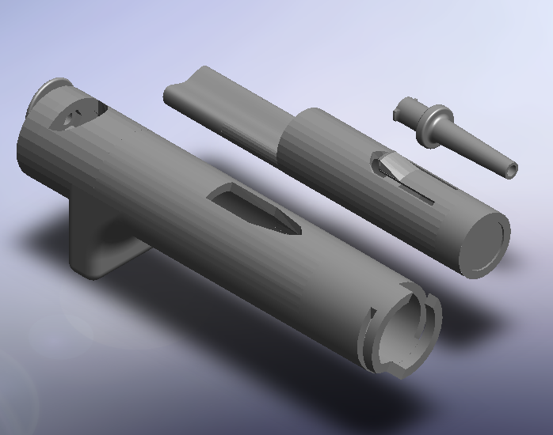

3D Printable Micropipette
=========================

This printable micropipette actuates a disposable syringe an adjustable set point using an assembly of 3D-printable parts and basic hardware.

##Additional Parts

1. M3 Hex Nut McMaster part# 90591A121
2. M3 20mm length, Socket Head Screw Mcmaster part # 91292A123
3. Metric Compression Spring 33mm Overall, part# 94125k542

Data in tables

## Specifications
Specifications may vary depending on the syringe
3mL Syringe
Pipet up to 1mL or 1000 uL +/-10 uL
Adjust in increments of 100 uL
Tolerance +/-10 uL

1mL Syringe 
Pipet up to 350uL +/- 1 uL
Adjust in increments of 10 uL
Tolerance +/-1 uL 

