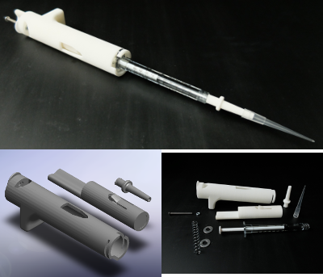
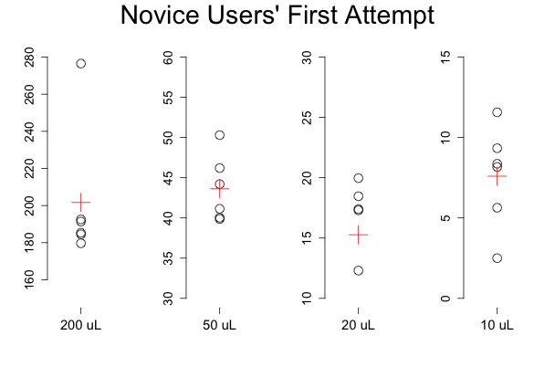

3D Printable Micropipette
=========================

This printable micropipette actuates a disposable syringe to an adjustable set-point using an assembly of 3D-printable parts and basic hardware.

##Additional Parts

1. M3 Hex Nut McMaster part# 90591A121
2. M3 20mm length, Socket Head Screw Mcmaster part # 91292A123
3. Metric Compression Spring 33mm Overall, part# 94125k542
4. 2 Washers Mcmaster part # 90107A012

Validation
----

|                    | 20 uL         | 50 uL        | 200 uL       |
|--------------------|---------------|--------------|--------------|
| Printed Pipette    | 19.5 ± 0.612  | 53.53 ± 1.76 | 196.4 ± 2.23 |
| Commercial Pipette | 19.87 ± 0.164 | 49.9 ± 0.141 | 204.5 ± 2.91 |

The printed pipette was compared to a commerical pipette and volumes of 20, 50 and 200 microliters. The precision is expressed as the standard deviation of the sample.

Data taken from first time users as the attempt to pipette 200 uL, 100 uL, 50 uL, and 10 uL. Black circles are individual attempts and red plus is the group average.

## Specifications
Specifications may vary depending on the syringe
3mL Syringe
Pipet up to 1mL or 1000 uL +/-10 uL
Adjust in increments of 100 uL
Tolerance +/-10 uL

1mL Syringe 
Pipet up to 350uL +/- 1 uL
Adjust in increments of 10 uL
Tolerance +/-1 uL 

